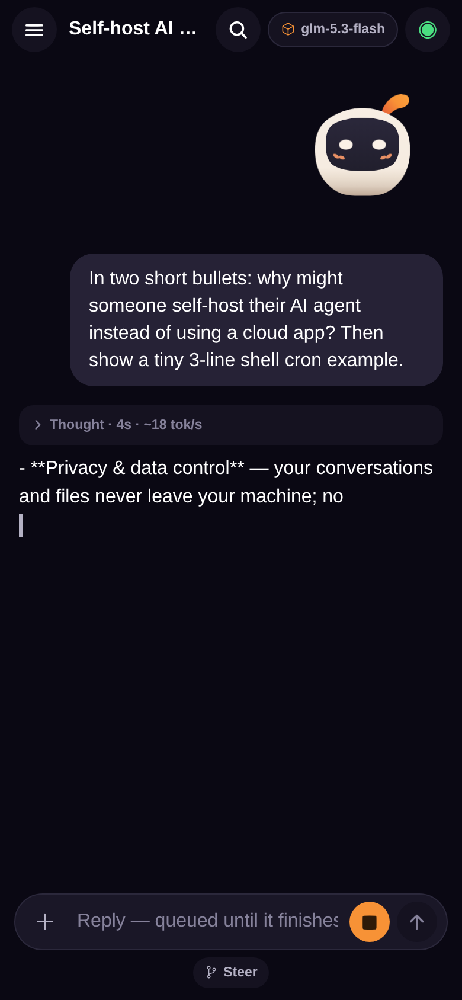
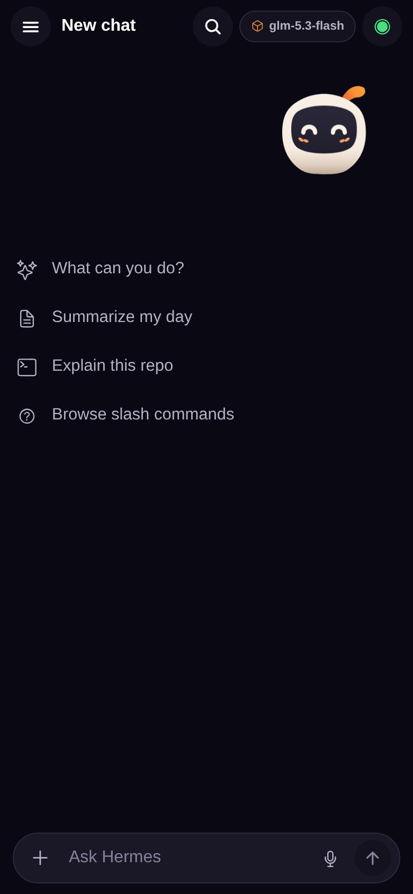
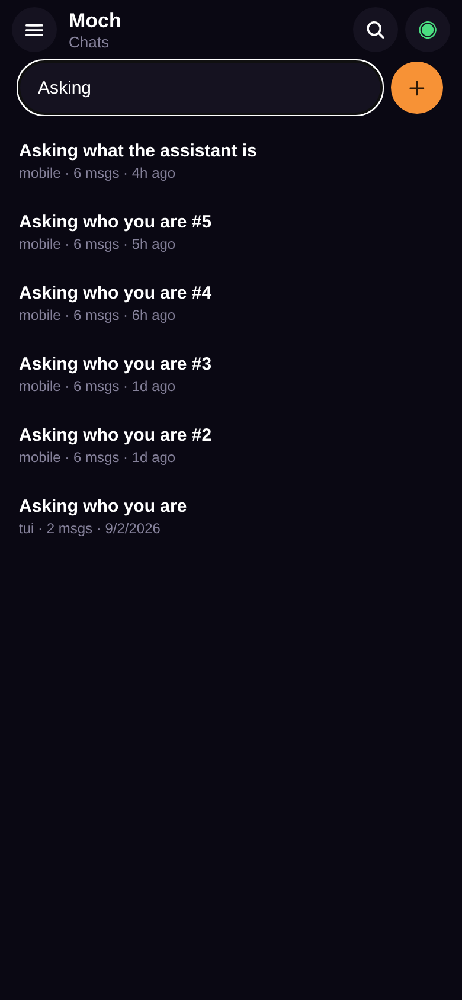
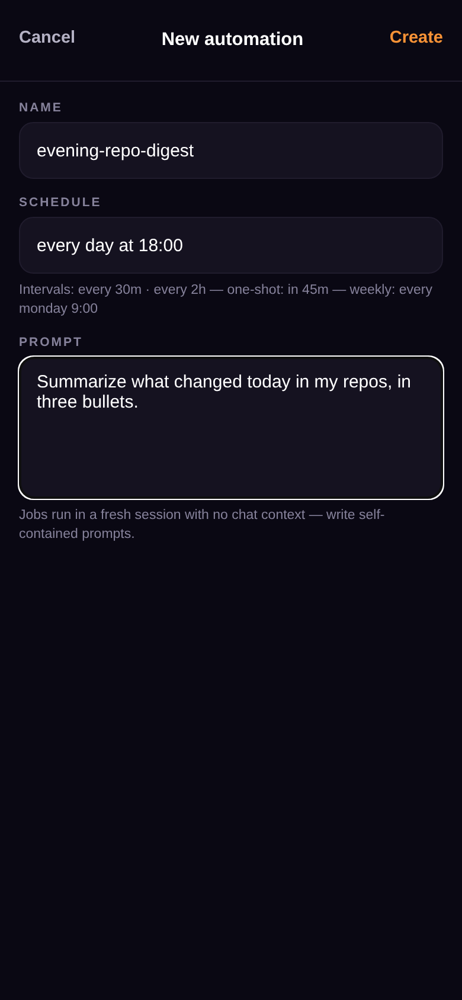

# Moch

**Your own hermes AI agent, in your pocket.**

[](https://github.com/SoftLand-Tech/Moch/releases/latest)
[](LICENSE)
[](https://github.com/SoftLand-Tech/Moch/releases/latest)

Moch is an open-source React Native (Expo 57) chat app for **your own [hermes](https://github.com/NousResearch/hermes-agent) agent** — and it can run that agent two ways: **on a machine you own** (a spare mini-PC, a homelab box, a VPS), with Moch as the window onto it from your phone, or **entirely on your phone** — hermes ships inside the APK, complete with a real Ubuntu Linux it can drive. Either way it's *your* agent: your keys, your sessions, your data. No accounts.

<p align="center">
  
</p>
<p align="center"><sub>A reply streaming live — the collapsed <em>Thinking</em> block shows elapsed time and ~tok/s.</sub></p>

<p align="center">
  
  
  
</p>

## Two ways to run your agent

**Linked — the agent on your own machine.** The classic setup: hermes runs on hardware you control, and the phone connects through the official relay (or self-hosted). This is what the current release APK ships — follow [the one-command setup](#set-it-up-with-moch-link--one-command-recommended) below.

**Embedded — the agent on the phone itself.** hermes runs inside the app: CPython 3.11 embedded in the APK, the agent booting at launch, and **Moch Linux** — a real Ubuntu 24.04 userspace under proot with apt, compilers and servers, so the agent can install and run whatever it needs. A foreground service keeps it alive in the background, automations fire on-device, and knocks (push notifications) tell you when a job is done. The embedded runtime is new and ships in development builds — not yet in the GitHub release APK.

## Set it up with moch-link — one command (recommended)

Already running hermes on your Linux machine? You're three steps away, and the first is a single line.

**1. On that machine:**

```sh
curl -fsSL https://moch.softland.tech/install.sh | bash
```

**moch-link** doesn't install, configure or modify hermes — it links your existing install (starting `hermes serve` for you as a background service if it isn't running) to the official **Moch relay**, and prints a **QR pairing code**. The tunnel dials the relay **outbound**, so it works from any network, behind any NAT: no router changes, no VPN, no domain. The relay (`api.moch.softland.tech`) is a pass-through — it stores nothing but a **token hash**; your data never leaves your machine. (You'll need `node` and `npm` on PATH; the tunnel needs them.)

**2. On your phone**, download `Moch-1.0.0.apk` from the [latest release](https://github.com/SoftLand-Tech/Moch/releases/latest) and install it.

**3. Scan the QR** the installer printed — the camera opens on Moch's first screen. That's it; you're talking to your own agent. Lost the code? `bash install.sh qr` reprints it.

## Starting fresh? Install hermes first

Don't have hermes yet? Install the agent itself — one line, straight from the [hermes project](https://github.com/NousResearch/hermes-agent) (Linux, macOS, WSL2, Termux):

```sh
curl -fsSL https://hermes-agent.nousresearch.com/install.sh | bash
```

Run `hermes` once to set it up (provider key, tools), then link it to your phone with the same moch-link command from the top:

```sh
curl -fsSL https://moch.softland.tech/install.sh | bash
```

The **real** hermes — nothing forked, wrapped or duplicated. Your sessions, memory and providers live in the same `~/.hermes` the CLI and gateway use.

The official relay (`api.moch.softland.tech`) is free to use while Moch is new — and because everything is open source, self-hosting the whole stack (app, link, [relay](relay/README.md)) is a permanent, free option.

📖 The full walkthrough (TLS, remote push for approvals, multi-computer pairing, troubleshooting) lives at **[moch.softland.tech/setup.html](https://moch.softland.tech/setup.html)**.

## What's in the repo

Moch is a monorepo: the whole product — phone app, link, and website — ships together.

| Path | What it is |
| --- | --- |
| [`app/`](app/) | The **Expo 57 React Native client** (React Native 0.86). Chat UI, pairing, sessions, voice in/out, OTA updates — plus the **embedded runtime**: CPython via Chaquopy (`app/python-runtime/`), the vendored hermes tree (`app/hermes-src/`), aarch64 wheels (`app/wheels-android/`), and the Kotlin bridge + proot Linux environment. |
| [`embedded/`](embedded/) | Design docs and milestone reports for the embedded runtime — the technical assessment, guest-exec under targetSdk 36, Moch Linux, knocks, and on-device verification procedures. |
| [`moch-link/`](moch-link/) | The **moch-link** installer — the one-command link between an existing hermes install and the official relay. [`docs/install.sh`](docs/install.sh) is the published copy served at `moch.softland.tech/install.sh`; keep the two in sync. |
| [`relay/`](relay/) | The **official relay** — the single-file Node service phones dial into. Run your own with [`relay/README.md`](relay/README.md); ours at `api.moch.softland.tech` is **free while Moch is new**. |
| [`docs/`](docs/) | The **website source** (this page's home), published to GitHub Pages. |

## Features

- **Streaming chat with thinking blocks** — answers stream token-by-token; reasoning arrives as collapsible *Thinking* blocks inline with the answer (elapsed time, ~tok/s, reasoning-effort chip), plus tool-call rows with status and duration. Markdown renders on completion, with copy and listen actions on every reply.
- **Mochi, the mascot** — a little robot that lives in the empty states and loading moments: it greets you, thinks, celebrates, and asks for approval with matching expressions.
- **Themes, including Mocheme** — a dark-first palette extracted from the logo, plus the Mocheme theme and friends, switchable in Settings.
- **Multi-session with attention badges** — every conversation is an independent session with its own messages, tools and todos; a turn keeps streaming in one while you read another, and a question waiting in the background shows as a badge instead of interrupting.
- **Media and voice messages** — send images to your agent; the mic button records and transcribes through the server's STT, and *Listen* plays a reply through the server's TTS. No audio API keys ever live on the phone.
- **Slash commands** — typing `/` drives off the gateway's own registry, so new server-side commands and skills appear without an app update.
- **Automations** — scheduled jobs (cron, in plain language: `every 30m`, `every monday 9:00`) that run on the server, so they fire even when the app is closed.
- **Moch Linux — a real Ubuntu, in your pocket** *(embedded mode)* — a full Ubuntu 24.04 userspace under proot inside the app's sandbox: the agent can `apt install`, compile, and run servers, all on-device. Verified working under Android's strictest targetSdk.
- **"Ask Moch" share target** — share text, links, images, videos, audio or PDFs from any app straight into Moch; content lands in the composer as a draft with attachment chips, and you hit Send.
- **Automation knocks** — when a scheduled job finishes (or needs you), Moch knocks with a push notification that lands even if the app was killed — tapping it opens the right chat.
- **Provider API keys** — connect and disconnect model providers from the app; keys are stored and used server-side.
- **OTA updates** — the app updates itself over the air; new features reach phones without a reinstall.

…plus multi-computer pairing, reconnect with lossless replay, an offline outbox, and local + remote push notifications for approvals. See [`app/README.md`](app/README.md) for the deep dive.

## Development

**The app** (`app/`) needs Node (SDK 57's documented runtime is Node 22.13.x):

```sh
cd app
npm install
npm run typecheck   # tsc --noEmit for the app and the scripts project
npm test            # protocol suite against a fake gateway — no server needed
```

**moch-link** (`moch-link/`) is a single self-installing bash script; the copy in [`docs/`](docs/install.sh) is the one the site serves — edit both together.

## Credits & license

- The Moch app and this repository's packaging are **MIT, © 2026 Mamoun Hisham** — see [LICENSE](LICENSE).
- Moch pairs with [hermes-agent](https://github.com/NousResearch/hermes-agent) by **Nous Research** (**MIT © 2025**) — the agent is installed from upstream, unmodified.

Issues and pull requests are welcome — for contribution gates, see the end of [`app/README.md`](app/README.md).
